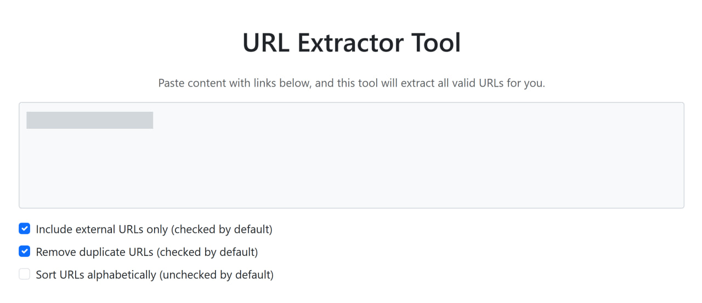
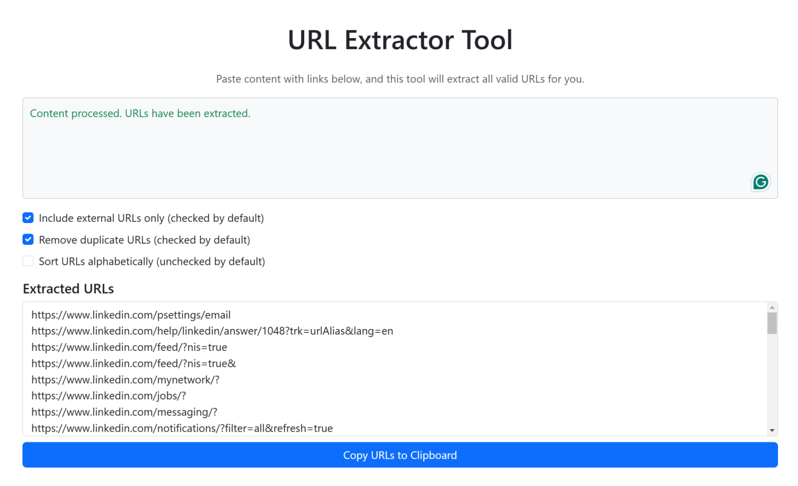

# URLExtractify

**URLExtractify** is a lightweight, web-based tool to extract URLs from pasted content efficiently. It allows users to remove duplicates, sort URLs alphabetically, and customize URL extraction preferences through a simple, intuitive interface.

## Features

- **Extract URLs:** Automatically fetch valid URLs from pasted HTML or plain text content.
- **Remove Duplicates:** Option to remove duplicate URLs from the output (enabled by default).
- **Sort URLs:** Option to sort URLs alphabetically or keep their original order (disabled by default).
- **Copy to Clipboard:** Easily copy the extracted URLs with one click.
- **Simple and Accessible UI:** User-friendly design with support for both external and internal URLs.

## Live Demo

Try it out online: [URLExtractify](https://basemax.github.io/URLExtractify/)

## Installation

To run URLExtractify locally:

1. Clone the repository:
    ```bash
    git clone https://github.com/BaseMax/URLExtractify.git
    ```
2. Navigate to the project directory:
    ```bash
    cd URLExtractify
    ```
3. Open `index.html` in your favorite browser.

## Usage

1. **Paste Content:** Copy and paste your content (e.g., emails, documents, or web pages) into the input box.
2. **Customize Settings:**
    - Check or uncheck the "Remove Duplicates" and "Sort URLs" options based on your preference.
    - Include or exclude external URLs using the checkbox.
3. **Extract URLs:** The tool processes the content and displays all extracted URLs in the output box.
4. **Copy URLs:** Click the "Copy URLs to Clipboard" button to copy the extracted URLs for further use.

## Screenshots





## Contributing

Contributions are welcome! Feel free to submit issues or create pull requests to improve this project.

1. Fork the repository.
2. Create a new branch for your feature or fix:
    ```bash
    git checkout -b feature-name
    ```
3. Commit your changes:
    ```bash
    git commit -m "Add feature description"
    ```
4. Push to your branch:
    ```bash
    git push origin feature-name
    ```
5. Submit a pull request.

## Acknowledgments

- Built with [Bootstrap](https://getbootstrap.com/) for responsive styling.
- Developed by [Max Base](https://github.com/BaseMax).

## License

This project is licensed under the **MIT License**.  
Copyright © 2025, Max Base.

See the [LICENSE](LICENSE) file for more details.
